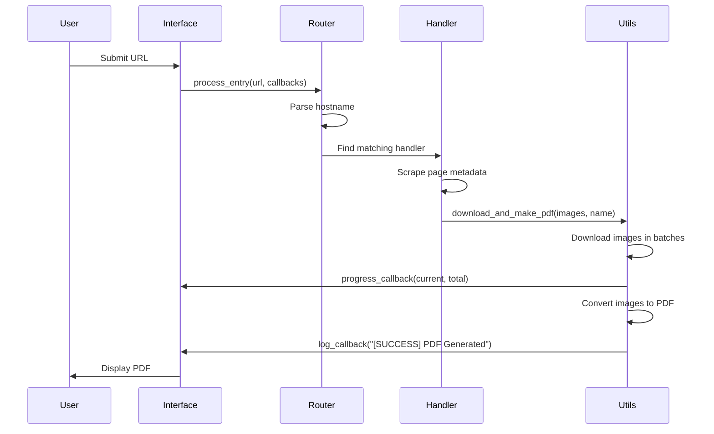

Universal Manga Downloader uses a clean, modular architecture built around the **Strategy Pattern**. This design makes it easy to add new manga sites without modifying core application logic.

## Core architecture principles

The application separates concerns into distinct layers:

- **Handler Router** - Central entry point that routes URLs to site-specific handlers
- **Site Handlers** - Pluggable strategies for each supported manga site
- **Utilities** - Shared functionality for downloads, PDF generation, and file management
- **Interfaces** - Multiple frontends (web, desktop, Discord) that consume the same core

## Strategy Pattern implementation

Each manga site implements the `BaseSiteHandler` abstract class, which defines two key methods:

```python core/sites/base.py
from abc import ABC, abstractmethod
from typing import Callable, Optional

class BaseSiteHandler(ABC):
    """Abstract base class for all site handlers."""
    
    @staticmethod
    @abstractmethod
    def get_supported_domains() -> list:
        """Returns a list of domain strings supported by this handler."""
        pass

    @abstractmethod
    async def process(
        self, 
        url: str, 
        log_callback: Callable[[str], None], 
        check_cancel: Callable[[], bool], 
        progress_callback: Optional[Callable[[int, int], None]] = None
    ) -> None:
        """Process the given URL to download manga/doujinshi."""
        pass
```

<Note>
The Strategy Pattern allows you to add support for new manga sites by simply creating a new handler class that implements `BaseSiteHandler`. No changes to the core routing logic are required.
</Note>

## Handler routing system

The `process_entry` function in `core/handler.py` acts as the central router. It receives a URL and delegates processing to the appropriate site handler:

```python core/handler.py
from typing import Callable, Optional
from .sites import (
    TMOHandler, 
    M440Handler, 
    H2RHandler, 
    HitomiHandler, 
    NHentaiHandler, 
    ZonaTMOHandler
)

# Instantiate all handlers (stateless approach)
HANDLERS = [
    TMOHandler(),
    M440Handler(),
    H2RHandler(),
    HitomiHandler(),
    NHentaiHandler(),
    ZonaTMOHandler()
]

async def process_entry(
    url: str,
    log_callback: Callable[[str], None],
    check_cancel: Callable[[], bool],
    progress_callback: Optional[Callable[[int, int], None]] = None
) -> None:
    """Main Router: Redirects to the specific site handler based on the URL."""
    try:
        parsed_url = urlparse(url)
        hostname = parsed_url.netloc.lower()
    except Exception:
        log_callback("[ERROR] Invalid URL provided.")
        return

    for handler in HANDLERS:
        supported = handler.get_supported_domains()
        if any(domain in hostname for domain in supported):
            await handler.process(url, log_callback, check_cancel, progress_callback)
            return
            
    log_callback("[ERROR] Unsupported website.")
```

### How routing works

1. Parse the hostname from the provided URL
2. Iterate through all registered handlers
3. Check if the hostname matches any supported domain
4. Delegate to the first matching handler's `process()` method
5. Return an error if no handler matches

<Info>
Handlers are instantiated once and reused for all requests (stateless design). This improves performance and reduces memory overhead.
</Info>

## Core package structure

The `core` package exposes a single public interface for all consumers:

```python core/__init__.py
from .handler import process_entry
# We expose process_entry for easier imports
# core.config should be imported directly if needed to modify runtime flags
```

This minimal API makes it simple for different interfaces to integrate with the downloader:

<CodeGroup>

```python Web Interface
import core
import core.config

# Disable auto-opening of files on server side
core.config.OPEN_RESULT_ON_FINISH = False

# Use the core
await core.process_entry(
    url, 
    log_callback, 
    check_cancel, 
    progress_callback=progress_callback
)
```

```python Desktop Interface
from core import process_entry

# Desktop can use default config (opens PDFs automatically)
await process_entry(
    url,
    log_callback,
    check_cancel,
    progress_callback
)
```

```python Discord Bot
from core import process_entry
import core.config

# Configure for Discord environment
core.config.OPEN_RESULT_ON_FINISH = False

await process_entry(
    url,
    lambda msg: await ctx.send(msg),
    lambda: False,  # Discord doesn't support cancellation
    progress_callback
)
```

</CodeGroup>

## Three interface model

The architecture supports multiple frontends that all consume the same core:

### Web interface

FastAPI server with WebSocket support for real-time progress updates. Located in `web_server.py`.

**Features:**
- Real-time log streaming
- Progress tracking
- Cancellation support
- PDF file serving

### Desktop interface

Tkinter-based GUI application providing a native desktop experience.

**Features:**
- File dialogs
- Local folder management
- Automatic PDF opening
- Visual progress bars

### Discord bot

Discord bot that allows users to download manga directly in Discord servers.

**Features:**
- Command-based interface
- PDF upload to Discord
- Per-user rate limiting
- Server-wide usage tracking

## Component interaction flow

Here's how components work together during a typical download:



<Accordion title="Callback system details">

The architecture uses three callback functions for interface communication:

- **`log_callback(msg: str)`** - Send status messages to the user
- **`check_cancel() -> bool`** - Allow users to cancel long-running operations
- **`progress_callback(current: int, total: int)`** - Update download progress

This callback-based design decouples the core from the interface layer, allowing each frontend to handle updates differently.

</Accordion>

## Adding a new site handler

To add support for a new manga site:

1. Create a new file in `core/sites/` (e.g., `mysite.py`)
2. Implement the `BaseSiteHandler` abstract class
3. Add your handler to `core/sites/__init__.py`
4. Register it in the `HANDLERS` list in `core/handler.py`

```python Example handler
from .base import BaseSiteHandler
from typing import Callable, Optional

class MySiteHandler(BaseSiteHandler):
    @staticmethod
    def get_supported_domains() -> list:
        return ["mysite.com", "www.mysite.com"]
    
    async def process(
        self,
        url: str,
        log_callback: Callable[[str], None],
        check_cancel: Callable[[], bool],
        progress_callback: Optional[Callable[[int, int], None]] = None
    ) -> None:
        log_callback("[INFO] Processing MyMangaSite...")
        # Your scraping and download logic here
```

<Warning>
Always validate and sanitize URLs in your handler to prevent security vulnerabilities. See the [Security features](/concepts/security) page for best practices.
</Warning>

## Configuration system

Global configuration is managed through `core/config.py`:

```python core/config.py
# Folder Names
TEMP_FOLDER_NAME = "temp_manga_images"
PDF_FOLDER_NAME = "PDF"

# Download Settings
BATCH_SIZE = 10
DEFAULT_PAGE_COUNT = 60

# Runtime Flags
OPEN_RESULT_ON_FINISH = True
```

You can modify these settings at runtime to customize behavior for different interfaces:

```python
import core.config

# Disable auto-opening for web interface
core.config.OPEN_RESULT_ON_FINISH = False

# Increase batch size for faster downloads
core.config.BATCH_SIZE = 20
```

## Benefits of this architecture

**Extensibility** - Add new sites without touching existing code

**Maintainability** - Clear separation of concerns makes debugging easier

**Reusability** - Single core serves multiple interfaces

**Testability** - Each handler can be tested independently

**Flexibility** - Interfaces can customize behavior through configuration

## Next steps

<CardGroup cols={2}>
  <Card title="Security features" icon="shield" href="/concepts/security">
    Learn about SSRF prevention, path traversal protection, and DoS mitigation
  </Card>
  <Card title="Async downloads" icon="download" href="/concepts/async-downloads">
    Understand how concurrent downloads work with asyncio and aiohttp
  </Card>
</CardGroup>