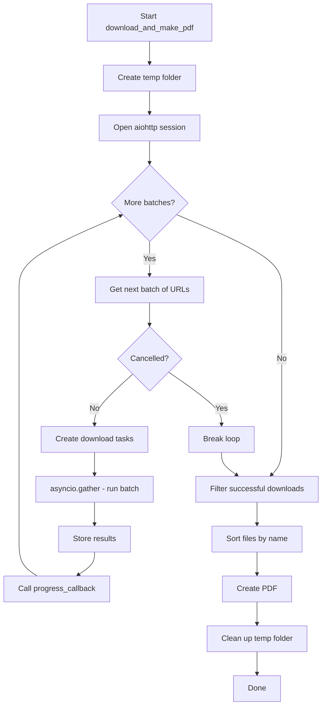

Universal Manga Downloader uses Python's `asyncio` and `aiohttp` libraries to download manga images concurrently. This approach dramatically improves download speeds compared to sequential downloading.

## Why async downloads?

Manga chapters typically contain 20-200 images. Downloading them sequentially would take:

```
100 images × 2 seconds each = 200 seconds (3.3 minutes)
```

With concurrent batch downloading:

```
100 images ÷ 10 per batch × 2 seconds = 20 seconds
```

**10x speed improvement** by downloading multiple images simultaneously.

## Core async architecture

The async download system consists of three main components:

1. **Session management** - Reusable HTTP connection pools
2. **Batch processing** - Concurrent downloads in configurable chunks
3. **Progress tracking** - Real-time callback updates

### Main orchestration function

The `download_and_make_pdf` function coordinates the entire async workflow:

```python core/utils.py
async def download_and_make_pdf(
    image_urls: List[str],
    output_name: str,
    headers: dict,
    log_callback: Callable[[str], None],
    check_cancel: Callable[[], bool],
    progress_callback: Optional[Callable[[int, int], None]] = None,
    is_path: bool = False,
    open_result: bool = True
) -> None:
    """Orchestration: Downloads images in chunks -> Creates PDF -> Cleans up."""
    project_root = os.getcwd()
    temp_folder = os.path.join(project_root, TEMP_FOLDER_NAME)
    
    # Clean/Create temp folder
    if os.path.exists(temp_folder):
        shutil.rmtree(temp_folder)
    os.makedirs(temp_folder, exist_ok=True)
    
    files = []
    
    async with aiohttp.ClientSession(headers=headers) as session:
        chunk_size = BATCH_SIZE
        results = []
        for i in range(0, len(image_urls), chunk_size):
            if check_cancel and check_cancel():
                log_callback("[INFO] Process cancelled by user.")
                break
            
            chunk = image_urls[i:i+chunk_size]
            tasks = [
                download_image(session, u, temp_folder, i + idx + 1, log_callback, headers)
                for idx, u in enumerate(chunk)
            ]
            res = await asyncio.gather(*tasks)
            results.extend(res)
            
            if progress_callback:
                progress_callback(min(i + chunk_size, len(image_urls)), len(image_urls))
        
        files = [f for f in results if f]
    
    files.sort()
    
    if files:
        if is_path:
            if create_pdf(files, output_name, log_callback):
                pass
        else:
            finalize_pdf_flow(files, output_name, log_callback, temp_folder, open_result=open_result)
            return
    
    if os.path.exists(temp_folder):
        shutil.rmtree(temp_folder)
    
    if not is_path:
        log_callback("[DONE] Finished.")
```

## Session management

HTTP sessions are managed using `aiohttp.ClientSession` with context managers.

### Connection pooling

```python
async with aiohttp.ClientSession(headers=headers) as session:
    # All downloads share this session
    # Connections are automatically pooled and reused
```

**Benefits:**

- **Connection reuse** - TCP connections stay open between requests
- **DNS caching** - Hostname lookups are cached
- **Keep-alive** - Reduces handshake overhead
- **Auto cleanup** - Context manager ensures proper resource cleanup

<Note>
The session is created once per download job and shared across all image downloads. This is more efficient than creating a new session for each image.
</Note>

### Custom headers

Headers are passed to the session to bypass anti-bot protections:

```python
headers = {
    "Referer": "https://manga-site.com/",
    "User-Agent": "Mozilla/5.0 (Windows NT 10.0; Win64; x64) ..."
}

async with aiohttp.ClientSession(headers=headers) as session:
    # Session headers apply to all requests
```

Each site handler provides its own headers from `core/config.py`:

```python core/config.py
HEADERS_TMO = {"Referer": "https://tmohentai.com/", "User-Agent": USER_AGENT}
HEADERS_HITOMI = {"Referer": "https://hitomi.la/", "User-Agent": USER_AGENT}
HEADERS_NHENTAI = {"User-Agent": USER_AGENT}
```

## Batch processing

Images are downloaded in configurable batches to balance speed and resource usage.

### Batch configuration

```python core/config.py
BATCH_SIZE = 10
```

This means:
- **10 images** download simultaneously
- Next batch starts after previous completes
- Total time = `(total_images / 10) × avg_download_time`

### Batch loop implementation

```python
chunk_size = BATCH_SIZE  # Default: 10
results = []

for i in range(0, len(image_urls), chunk_size):
    # Check for cancellation
    if check_cancel and check_cancel():
        log_callback("[INFO] Process cancelled by user.")
        break
    
    # Get next batch of URLs
    chunk = image_urls[i:i+chunk_size]
    
    # Create download tasks
    tasks = [
        download_image(session, u, temp_folder, i + idx + 1, log_callback, headers)
        for idx, u in enumerate(chunk)
    ]
    
    # Execute batch concurrently
    res = await asyncio.gather(*tasks)
    results.extend(res)
    
    # Update progress
    if progress_callback:
        progress_callback(min(i + chunk_size, len(image_urls)), len(image_urls))
```

<Accordion title="Why use batches instead of downloading everything at once?">

**Memory management** - Each download consumes memory. Batching prevents excessive memory usage.

**Connection limits** - Servers may limit concurrent connections per client.

**Error handling** - If one batch fails, others can still succeed.

**Progress tracking** - Batches provide natural checkpoints for progress updates.

**Resource fairness** - Prevents one download job from monopolizing all system resources.

</Accordion>

### asyncio.gather() behavior

```python
res = await asyncio.gather(*tasks)
```

**What it does:**

- Runs all tasks concurrently (not sequentially)
- Waits for **all** tasks to complete
- Returns results in the same order as tasks
- If any task raises an exception, `gather()` propagates it

**Example:**

```python
tasks = [
    download_image(session, "url1", ..., 1, ...),
    download_image(session, "url2", ..., 2, ...),
    download_image(session, "url3", ..., 3, ...),
]

# All three download simultaneously
results = await asyncio.gather(*tasks)
# results = ["path1.jpg", "path2.jpg", "path3.jpg"]
```

## Single image download

The `download_image` function handles individual image downloads:

```python core/utils.py
async def download_image(
    session: aiohttp.ClientSession,
    url: str,
    folder: str,
    index: int,
    log_callback: Callable[[str], None],
    headers: dict
) -> Optional[str]:
    """Downloads a single image asynchronously and saves it to disk."""
    try:
        # Determine extension from URL
        ext = ".jpg"
        if ".webp" in url: ext = ".webp"
        elif ".png" in url: ext = ".png"
        elif ".jpeg" in url: ext = ".jpeg"
        elif ".avif" in url: ext = ".avif"
        
        # Create zero-padded filename for sorting
        filename = f"{index:03d}{ext}"
        filepath = os.path.join(folder, filename)
        
        # Perform async HTTP GET
        async with session.get(url, headers=headers) as resp:
            if resp.status == 200:
                content = await resp.read()
                with open(filepath, 'wb') as f:
                    f.write(content)
                return filepath
            else:
                log_callback(f"[ERROR] Failed to download image {index}: Status {resp.status}")
                return None
    except Exception as e:
        log_callback(f"[ERROR] Failed to download image {index}: {str(e)}")
        return None
```

### Key features

**Extension detection** - Determines file type from URL:

```python
if ".webp" in url: ext = ".webp"
elif ".png" in url: ext = ".png"
```

**Zero-padded filenames** - Ensures correct sort order:

```python
filename = f"{index:03d}{ext}"  # 001.jpg, 002.jpg, ..., 099.jpg, 100.jpg
```

**Error handling** - Returns `None` on failure instead of crashing:

```python
files = [f for f in results if f]  # Filter out None values
```

**Async context manager** - Automatically handles response cleanup:

```python
async with session.get(url, headers=headers) as resp:
    # Response is automatically closed after this block
```

<Info>
The function returns the file path on success or `None` on failure. This allows the orchestrator to track which downloads succeeded.
</Info>

## Progress callbacks

Progress updates are sent to the interface layer through callbacks.

### Callback interface

```python
def progress_callback(current: int, total: int) -> None:
    """Called after each batch completes."""
    percentage = (current / total) * 100
    print(f"Progress: {current}/{total} ({percentage:.1f}%)")
```

### Integration example

<CodeGroup>

```python Web Interface
def progress_callback(current, total):
    loop = asyncio.get_event_loop()
    if loop.is_running():
        loop.create_task(websocket.send_json({
            "type": "progress",
            "current": current,
            "total": total
        }))

await core.process_entry(
    url,
    log_callback,
    check_cancel,
    progress_callback=progress_callback
)
```

```python Desktop GUI
def progress_callback(current, total):
    progress_bar['value'] = (current / total) * 100
    percentage_label['text'] = f"{current}/{total}"
    window.update_idletasks()

await process_entry(
    url,
    log_callback,
    check_cancel,
    progress_callback
)
```

</CodeGroup>

### When callbacks are invoked

Progress callbacks fire after **each batch** completes:

```python
for i in range(0, len(image_urls), chunk_size):
    chunk = image_urls[i:i+chunk_size]
    tasks = [...]
    res = await asyncio.gather(*tasks)
    results.extend(res)
    
    # Called here after each batch
    if progress_callback:
        progress_callback(min(i + chunk_size, len(image_urls)), len(image_urls))
```

For 100 images with `BATCH_SIZE=10`, the callback fires **10 times**:

```
10/100, 20/100, 30/100, ..., 100/100
```

## Cancellation support

Users can cancel long-running downloads through the `check_cancel` callback.

### Cancellation interface

```python
def check_cancel() -> bool:
    """Returns True if user requested cancellation."""
    return is_cancelled
```

### Check points

Cancellation is checked **between batches**, not during:

```python
for i in range(0, len(image_urls), chunk_size):
    # Check before starting next batch
    if check_cancel and check_cancel():
        log_callback("[INFO] Process cancelled by user.")
        break
    
    # This batch will complete even if cancelled during execution
    chunk = image_urls[i:i+chunk_size]
    res = await asyncio.gather(*tasks)
```

<Warning>
Cancellation is not instantaneous. The current batch must complete before cancellation takes effect. This ensures files aren't left in a corrupted state.
</Warning>

### Web interface cancellation

```python web_server.py
cancel_event = asyncio.Event()
is_cancelled = False

def check_cancel():
    return is_cancelled

# When user clicks cancel button
if command == "cancel":
    is_cancelled = True
    await websocket.send_json({"type": "log", "message": "Cancelling..."})
```

## Performance tuning

You can adjust download performance by modifying `BATCH_SIZE`:

```python core/config.py
# Faster but uses more resources
BATCH_SIZE = 20

# Slower but more conservative
BATCH_SIZE = 5

# Default balanced setting
BATCH_SIZE = 10
```

### Choosing the right batch size

| Batch Size | Speed | Memory Usage | CPU Usage | Best For |
|------------|-------|--------------|-----------|----------|
| 5 | Slower | Low | Low | Weak servers, limited bandwidth |
| 10 | Balanced | Moderate | Moderate | Most deployments (default) |
| 20 | Faster | High | High | Powerful servers, fast internet |
| 50+ | Fastest | Very High | Very High | Not recommended (may get rate-limited) |

<Note>
Increasing batch size beyond 20 often provides diminishing returns and may trigger rate limiting from manga sites.
</Note>

## Error handling

The async system gracefully handles download failures:

```python
files = [f for f in results if f]
```

Failed downloads return `None` and are filtered out. The PDF is still created with successfully downloaded images.

### Partial success behavior

If 95 out of 100 images download successfully:

```python
# 95 files returned, 5 returned None
files = [f for f in results if f]  # Length: 95
files.sort()

if files:
    # PDF is created with 95 images
    finalize_pdf_flow(files, output_name, log_callback, temp_folder)
```

Users receive error logs for failed images but still get a usable PDF.

## Best practices

**Use shared sessions** - Create one session per download job, not per image

```python
# ✅ Good
async with aiohttp.ClientSession() as session:
    for url in urls:
        await download_image(session, url, ...)

# ❌ Bad
for url in urls:
    async with aiohttp.ClientSession() as session:
        await download_image(session, url, ...)
```

**Respect batch sizes** - Don't download hundreds of images simultaneously

**Check for cancellation** - Test `check_cancel()` between batches

**Handle None results** - Failed downloads return `None`, filter them out

**Close resources properly** - Use `async with` for automatic cleanup

## Async download flow diagram



## Next steps

<CardGroup cols={2}>
  <Card title="PDF generation" icon="file-pdf" href="/concepts/pdf-generation">
    Learn how downloaded images are compiled into PDFs
  </Card>
  <Card title="Architecture" icon="sitemap" href="/concepts/architecture">
    Understand how async downloads fit into the overall architecture
  </Card>
</CardGroup>