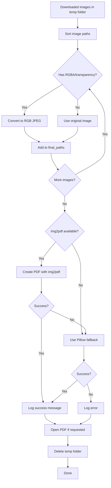

Universal Manga Downloader converts downloaded manga images into PDF files using the `img2pdf` library with a Pillow fallback. This process handles various image formats and ensures compatibility across all platforms.

## PDF generation overview

The PDF generation system consists of three main functions:

1. **`create_pdf()`** - Converts images to PDF format
2. **`finalize_pdf_flow()`** - Orchestrates PDF creation and cleanup
3. **Image format conversion** - Handles RGBA/transparency issues

## The create_pdf function

The core PDF compilation function uses `img2pdf` for fast, lossless conversion:

```python core/utils.py
def create_pdf(
    image_paths: List[str],
    output_pdf: str,
    log_callback: Callable[[str], None]
) -> bool:
    """Compiles a list of image paths into a single PDF using img2pdf (if available) or Pillow."""
    if not image_paths:
        log_callback("[WARN] No images to compile into PDF.")
        return False

    final_paths = []
    
    try:
        # Step 1: Convert RGBA images to RGB
        for path in image_paths:
            try:
                with Image.open(path) as img:
                    if img.mode in ("RGBA", "LA") or (img.mode == "P" and "transparency" in img.info):
                        head, tail = os.path.split(path)
                        new_filename = os.path.splitext(tail)[0] + "_converted.jpg"
                        new_path = os.path.join(head, new_filename)
                        img.convert("RGB").save(new_path, "JPEG", quality=90)
                        final_paths.append(new_path)
                    else:
                        final_paths.append(path)
            except Exception:
                final_paths.append(path)
        
        # Step 2: Use img2pdf for fast conversion
        if img2pdf:
            with open(output_pdf, "wb") as f:
                f.write(img2pdf.convert(final_paths, rotation=img2pdf.Rotation.ifvalid))
        else:
            raise ImportError("img2pdf not installed")

        # Step 3: Generate success message with relative path
        try:
            project_root = os.getcwd()
            pdf_root = os.path.join(project_root, PDF_FOLDER_NAME)
            
            if os.path.abspath(output_pdf).startswith(os.path.abspath(pdf_root)):
                logged_path = os.path.relpath(output_pdf, pdf_root)
            else:
                logged_path = os.path.basename(output_pdf)
            logged_path = logged_path.replace("\\", "/")
        except:
            logged_path = os.path.basename(output_pdf)

        log_callback(f"[SUCCESS] PDF Generated: {logged_path}")
        return True

    except Exception as e:
        # Fallback to Pillow method
        log_callback(f"[ERROR] Failed to save PDF (img2pdf): {e}")
        try:
            log_callback("[INFO] Trying alternative method (Pillow)...")
            images = []
            for path in image_paths:
                try:
                    with Image.open(path) as img:
                        if img.mode in ("RGBA", "P"): img = img.convert("RGB")
                        images.append(img.copy())
                except: pass
                
            if images:
                images[0].save(
                    output_pdf,
                    "PDF",
                    resolution=100.0,
                    save_all=True,
                    append_images=images[1:]
                )
                return True
        except Exception as e2:
            log_callback(f"[ERROR] Alternative method failed: {e2}")
        
        return False
```

## Image format conversion

PDF libraries require images in RGB format. Transparent images (RGBA, PNG with alpha) must be converted.

### Why conversion is necessary

Many manga sites serve images in formats that `img2pdf` cannot handle directly:

- **WebP with alpha channel** - Transparent backgrounds
- **PNG with transparency** - Common for overlays
- **RGBA images** - 4-channel color with alpha
- **Palette mode with transparency** - Indexed color + alpha

Attempting to create a PDF from these formats results in:

```
img2pdf.error: Refusing to work with images with alpha channel
```

### Conversion logic

```python
for path in image_paths:
    try:
        with Image.open(path) as img:
            # Check if image has transparency
            if img.mode in ("RGBA", "LA") or (img.mode == "P" and "transparency" in img.info):
                # Convert to RGB and save as JPEG
                head, tail = os.path.split(path)
                new_filename = os.path.splitext(tail)[0] + "_converted.jpg"
                new_path = os.path.join(head, new_filename)
                img.convert("RGB").save(new_path, "JPEG", quality=90)
                final_paths.append(new_path)
            else:
                # Use original image
                final_paths.append(path)
    except Exception:
        # If conversion fails, use original
        final_paths.append(path)
```

### Detected modes

| Mode | Description | Action |
|------|-------------|--------|
| `RGBA` | RGB with alpha channel | Convert to RGB JPEG |
| `LA` | Grayscale with alpha | Convert to RGB JPEG |
| `P` with transparency | Palette mode with alpha | Convert to RGB JPEG |
| `RGB` | Standard RGB | Use as-is |
| `L` | Grayscale | Use as-is |

<Note>
The conversion uses JPEG quality 90 to balance file size and image quality. This is suitable for manga images which are typically high-contrast line art.
</Note>

### Conversion example

```python
# Before conversion
image_paths = [
    "temp/001.png",   # RGBA
    "temp/002.webp",  # RGB
    "temp/003.png"    # RGBA
]

# After conversion
final_paths = [
    "temp/001_converted.jpg",  # Converted
    "temp/002.webp",           # Original
    "temp/003_converted.jpg"   # Converted
]
```

## Using img2pdf library

The primary PDF generation method uses `img2pdf` for optimal results.

### Why img2pdf?

**Lossless** - Images are embedded without recompression

**Fast** - No image processing required

**Small files** - PDFs contain raw image data, not reencoded versions

**Preserves quality** - Original image quality is maintained

### img2pdf usage

```python
if img2pdf:
    with open(output_pdf, "wb") as f:
        f.write(img2pdf.convert(
            final_paths,
            rotation=img2pdf.Rotation.ifvalid
        ))
```

**Parameters:**

- `final_paths` - List of image file paths to include
- `rotation=img2pdf.Rotation.ifvalid` - Auto-rotate based on EXIF metadata

### Auto-rotation

The `ifvalid` rotation parameter:

```python
rotation=img2pdf.Rotation.ifvalid
```

This automatically rotates images based on their EXIF orientation tag. Useful for manga scanned on mobile devices.

<Accordion title="EXIF orientation values">

| Value | Orientation | Applied Rotation |
|-------|-------------|------------------|
| 1 | Normal | None |
| 3 | Upside down | 180° |
| 6 | Rotated 90° CW | 270° CCW |
| 8 | Rotated 90° CCW | 90° CW |

The `ifvalid` setting applies these rotations automatically when valid EXIF data is present.

</Accordion>

## Pillow fallback method

If `img2pdf` fails or isn't installed, the system falls back to Pillow.

### When fallback is triggered

- `img2pdf` is not installed
- `img2pdf` raises an exception (corrupted image, unsupported format)
- Primary method fails for any reason

### Fallback implementation

```python
except Exception as e:
    log_callback(f"[ERROR] Failed to save PDF (img2pdf): {e}")
    try:
        log_callback("[INFO] Trying alternative method (Pillow)...")
        images = []
        for path in image_paths:
            try:
                with Image.open(path) as img:
                    if img.mode in ("RGBA", "P"):
                        img = img.convert("RGB")
                    images.append(img.copy())
            except: pass
            
        if images:
            images[0].save(
                output_pdf,
                "PDF",
                resolution=100.0,
                save_all=True,
                append_images=images[1:]
            )
            return True
    except Exception as e2:
        log_callback(f"[ERROR] Alternative method failed: {e2}")
```

### Pillow PDF parameters

```python
images[0].save(
    output_pdf,        # Output file path
    "PDF",             # Format
    resolution=100.0,  # DPI for image sizing
    save_all=True,     # Multi-page PDF
    append_images=images[1:]  # Additional pages
)
```

**Key differences from img2pdf:**

- **Recompression** - Images may be recompressed (quality loss)
- **Slower** - More CPU-intensive
- **Larger files** - Less efficient encoding
- **More compatible** - Handles more edge cases

<Warning>
The Pillow method may reduce image quality through recompression. It should only be used as a last resort when img2pdf fails.
</Warning>

## File naming and organization

PDF files are organized in a dedicated output directory with clean naming.

### Output directory structure

```
project_root/
├── PDF/                          # PDF_FOLDER_NAME from config
│   ├── One Piece Chapter 1.pdf
│   ├── Naruto Chapter 45.pdf
│   └── Series Name/              # Optional subdirectories
│       └── Chapter 12.pdf
└── temp_manga_images/            # Temporary download directory
    ├── 001.jpg
    ├── 002.jpg
    └── ...                       # Deleted after PDF creation
```

### Directory creation

```python
project_root = os.getcwd()
pdf_dir = os.path.join(project_root, PDF_FOLDER_NAME)
os.makedirs(pdf_dir, exist_ok=True)

output_pdf = os.path.join(pdf_dir, pdf_name)
```

<Info>
The `exist_ok=True` parameter prevents errors if the directory already exists, making the code safe for repeated executions.
</Info>

### Filename sanitization

Manga titles are sanitized before use as filenames:

```python core/utils.py
def clean_filename(text: str) -> str:
    """Sanitizes the string to create a valid Windows/Linux file name."""
    if not text: return "untitled"
    text = re.sub(r'<[^>]+>', '', text)  # Remove HTML tags
    safe = re.sub(r'[\\/*?:"<>|]', "", text).strip()  # Remove reserved chars
    return safe if safe else "untitled"
```

**Example:**

```python
clean_filename("One Piece: Chapter 1000!")  # "One Piece Chapter 1000"
clean_filename("Invalid/Name\\Here")        # "InvalidNameHere"
clean_filename("<b>HTML</b> Title")        # "HTML Title"
```

## The finalize_pdf_flow function

The `finalize_pdf_flow` function orchestrates the complete PDF workflow:

```python core/utils.py
def finalize_pdf_flow(
    image_paths: List[str],
    pdf_name: str,
    log_callback: Callable[[str], None],
    temp_dir: Optional[str] = None,
    open_result: bool = True
):
    """Creates PDF, Opens it/Folder (if open_result is True), and Cleans up temp dir."""
    project_root = os.getcwd()
    pdf_dir = os.path.join(project_root, PDF_FOLDER_NAME)
    os.makedirs(pdf_dir, exist_ok=True)
    
    output_pdf = os.path.join(pdf_dir, pdf_name)
    log_callback(f"[INFO] Generating PDF: {pdf_name}")
    
    if create_pdf(image_paths, output_pdf, log_callback):
        if open_result:
            if os.path.exists(output_pdf):
                try: os.startfile(os.path.dirname(output_pdf))
                except: pass
                try: os.startfile(output_pdf)
                except: pass
        log_callback("[DONE] Finished.")
    else:
        log_callback("[ERROR] Could not create PDF.")

    if temp_dir and os.path.exists(temp_dir):
        try:
            shutil.rmtree(temp_dir)
        except: pass
```

### Workflow steps

1. **Create output directory** - Ensure PDF folder exists
2. **Generate PDF** - Call `create_pdf()` with images
3. **Open result** - Launch PDF viewer (if `open_result=True`)
4. **Clean up** - Delete temporary download directory

### Auto-opening PDFs

The function can automatically open generated PDFs:

```python
if open_result:
    if os.path.exists(output_pdf):
        try: os.startfile(os.path.dirname(output_pdf))  # Open folder
        except: pass
        try: os.startfile(output_pdf)  # Open PDF
        except: pass
```

**Platform compatibility:**

- **Windows** - `os.startfile()` opens files with default applications
- **Linux/Mac** - `os.startfile()` raises `AttributeError`, caught silently

<Note>
The web interface sets `core.config.OPEN_RESULT_ON_FINISH = False` to disable auto-opening, since the server may run on a different machine than the browser.
</Note>

### Cleanup strategy

```python
if temp_dir and os.path.exists(temp_dir):
    try:
        shutil.rmtree(temp_dir)
    except: pass
```

Temporary files are always deleted after PDF creation, even if opening fails. This prevents disk space accumulation over time.

## PDF generation flow

The complete process from download to PDF:



## Image sorting

Images are sorted before PDF creation to ensure correct page order:

```python
files.sort()
```

This relies on zero-padded filenames from the download function:

```python
filename = f"{index:03d}{ext}"  # 001.jpg, 002.jpg, ..., 099.jpg, 100.jpg
```

Without padding, lexicographic sorting would produce:

```
1.jpg, 10.jpg, 100.jpg, 2.jpg, 20.jpg, ...  # ❌ Wrong order
```

With padding:

```
001.jpg, 002.jpg, 003.jpg, ..., 099.jpg, 100.jpg  # ✅ Correct order
```

## Error handling strategies

### Graceful degradation

The system handles errors at multiple levels:

**Image conversion** - If conversion fails, use original image:

```python
try:
    img.convert("RGB").save(new_path, "JPEG", quality=90)
    final_paths.append(new_path)
except Exception:
    final_paths.append(path)  # Use original
```

**Primary method** - If img2pdf fails, try Pillow:

```python
try:
    # img2pdf method
except Exception as e:
    # Pillow fallback
```

**File operations** - Cleanup attempts never crash:

```python
try:
    shutil.rmtree(temp_dir)
except: pass  # Ignore cleanup errors
```

### User feedback

All errors are reported through the log callback:

```python
log_callback(f"[ERROR] Failed to save PDF (img2pdf): {e}")
log_callback("[INFO] Trying alternative method (Pillow)...")
```

This keeps users informed about what's happening and whether the process succeeded.

## Configuration options

PDF generation can be customized through `core/config.py`:

```python core/config.py
# Folder Names
PDF_FOLDER_NAME = "PDF"             # Output directory name
TEMP_FOLDER_NAME = "temp_manga_images"  # Temporary download directory

# Runtime Flags
OPEN_RESULT_ON_FINISH = True        # Auto-open PDFs after creation
```

Modify at runtime for different interfaces:

```python
import core.config

# Disable auto-opening for server environments
core.config.OPEN_RESULT_ON_FINISH = False

# Use custom output directory
core.config.PDF_FOLDER_NAME = "output/manga"
```

## Best practices

**Always sort images** - Ensure correct page order with `files.sort()`

**Handle transparency** - Convert RGBA images to RGB before PDF creation

**Use img2pdf first** - It's faster and produces better quality

**Provide fallbacks** - Have a backup method if primary fails

**Clean up temporary files** - Delete downloads after PDF creation

**Log all errors** - Use callbacks to inform users of failures

**Sanitize filenames** - Remove invalid characters from manga titles

**Use context managers** - Ensure images are properly closed

## Next steps

<CardGroup cols={2}>
  <Card title="Async downloads" icon="download" href="/concepts/async-downloads">
    Learn how images are downloaded before PDF generation
  </Card>
  <Card title="Architecture" icon="sitemap" href="/concepts/architecture">
    Understand how PDF generation fits into the overall system
  </Card>
</CardGroup>