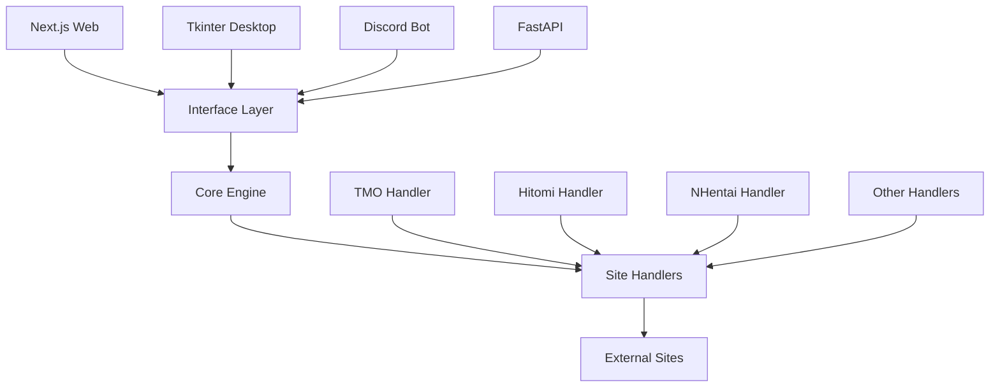

## What is Universal Manga Downloader?

Universal Manga Downloader is a robust, open-source automation tool that downloads manga from multiple popular websites and converts them into high-quality PDF files. Built with a modular Python core and offering multiple deployment options, it provides flexibility for both casual users and developers.

The project features a modern Next.js web interface, a legacy desktop GUI, and a Discord bot integration - all powered by the same battle-tested core engine.

<CardGroup cols={2}>
  <Card title="Web interface" icon="browser" href="/deployment/web-app">
    Modern dashboard with real-time progress tracking
  </Card>
  <Card title="Desktop app" icon="desktop" href="/deployment/desktop-app">
    Standalone Tkinter GUI for local use
  </Card>
  <Card title="Discord bot" icon="discord" href="/deployment/discord-bot">
    Remote downloads via Discord commands
  </Card>
  <Card title="API" icon="code" href="/api/handler">
    FastAPI backend for custom integrations
  </Card>
</CardGroup>

## Key features

### Multi-site support

The downloader supports 6+ major manga sites with intelligent extraction strategies:

- **Z-TMO** - Full series and single chapter support using Crawl4AI
- **TMO-H** - AI-powered image detection with Crawl4AI
- **M440** - Cover and chapter downloads via crawler
- **H2R** - Fast metadata extraction using JSON parsing
- **Hi.la** - Stealth browser mode to bypass protections
- **NH.net** - API + browser combo with Cloudflare bypass

### Modern architecture

<Note>
  The core package uses the **Strategy Pattern** for easy extensibility. Each site handler implements the `BaseSiteHandler` interface, making it simple to add new sites.
</Note>

**Asynchronous by design**

Built on `asyncio` and `aiohttp` for high-performance concurrent downloads. Multiple images are downloaded in parallel with configurable batch sizes.

```python
# Example: Core handler routing
from core import process_entry

async def download_manga(url: str):
    await process_entry(
        url=url,
        log_callback=lambda msg: print(msg),
        check_cancel=lambda: False
    )
```

**Intelligent extraction**

Utilizes **Crawl4AI** for smart image extraction and parsing of complex sites with dynamic content loading.

### Security-first design

The project includes multiple security layers:

- **SSRF Protection** - Strict hostname verification prevents server-side request forgery
- **Path Traversal Prevention** - Absolute path checking blocks directory traversal attacks
- **CORS Enforcement** - Mitigates cross-origin vulnerabilities
- **Rate Limiting** - Basic DoS protection with concurrent download limits

```python
# SSRF protection in handler.py
for handler in HANDLERS:
    supported = handler.get_supported_domains()
    # Validates hostname, not just URL string
    if any(domain in hostname for domain in supported):
        await handler.process(url, log_callback, check_cancel)
        return
```

### Real-time feedback

Whether you're using the web interface, desktop app, or Discord bot, you get:

- Live progress bars showing download status
- Detailed logging of each operation
- WebSocket integration for instant updates
- Error reporting with actionable messages

## Use cases

### Personal archiving

Download your favorite manga series for offline reading or backup purposes. The high-quality PDF output preserves image quality and includes proper page ordering.

### Batch processing

Process multiple chapters or entire series efficiently with concurrent downloads. The asynchronous engine handles multiple URLs without blocking.

### Remote access

Deploy the Discord bot to download manga from any device with Discord access. Files over 8MB are automatically uploaded to GoFile for easy retrieval.

```python
# Discord bot usage
!descargar https://example.com/manga/chapter-1
```

### Custom automation

Integrate the FastAPI backend into your own workflows. The WebSocket API provides programmatic access to all functionality.

## Architecture overview

Universal Manga Downloader uses a three-layer architecture:



### Interface layer

Multiple deployment options that all consume the same core functionality:

- **Web client** (`web_client_next/`) - Next.js 15 dashboard with TailwindCSS
- **Desktop app** (`app.py`) - Tkinter GUI for standalone use
- **Discord bot** (`bot.py`) - Discord.py integration
- **API server** (`web_server.py`) - FastAPI backend with WebSocket support

### Core engine

The `core/` package provides the main processing logic:

- `handler.py` - Central router that delegates to site-specific handlers
- `config.py` - Centralized configuration management
- `utils.py` - PDF generation and file management utilities

### Site handlers

Each supported site has a dedicated handler in `core/sites/`:

```python
from abc import ABC, abstractmethod

class BaseSiteHandler(ABC):
    @staticmethod
    @abstractmethod
    def get_supported_domains() -> list:
        """Returns supported domain strings"""
        pass

    @abstractmethod
    async def process(self, url, log_callback, check_cancel):
        """Download and process manga from URL"""
        pass
```

Handlers use various technologies:

- **Crawl4AI** - Intelligent web scraping for complex sites
- **Playwright** - Browser automation for JavaScript-heavy pages
- **aiohttp** - Fast async HTTP requests for APIs

<Info>
  All handlers implement cancellation support and progress reporting through callback functions.
</Info>

## Next steps

<CardGroup cols={2}>
  <Card title="Install" icon="download" href="/installation">
    Set up the project on your machine
  </Card>
  <Card title="Quick start" icon="rocket" href="/quickstart">
    Download your first manga in 5 minutes
  </Card>
  <Card title="Deploy" icon="server" href="/deployment/web-app">
    Choose your deployment method
  </Card>
  <Card title="API reference" icon="code" href="/api/handler">
    Explore the core API
  </Card>
</CardGroup>
